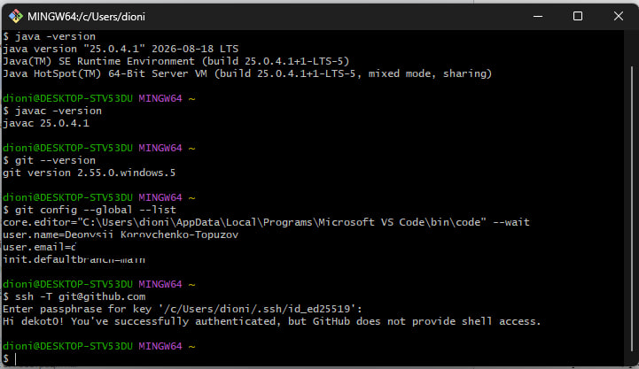
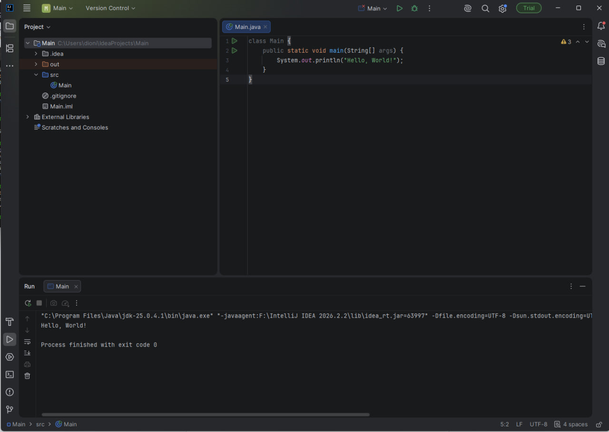
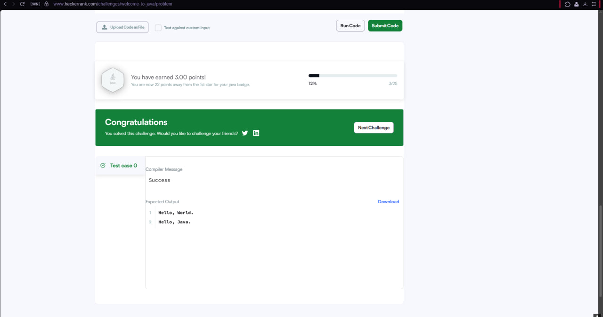
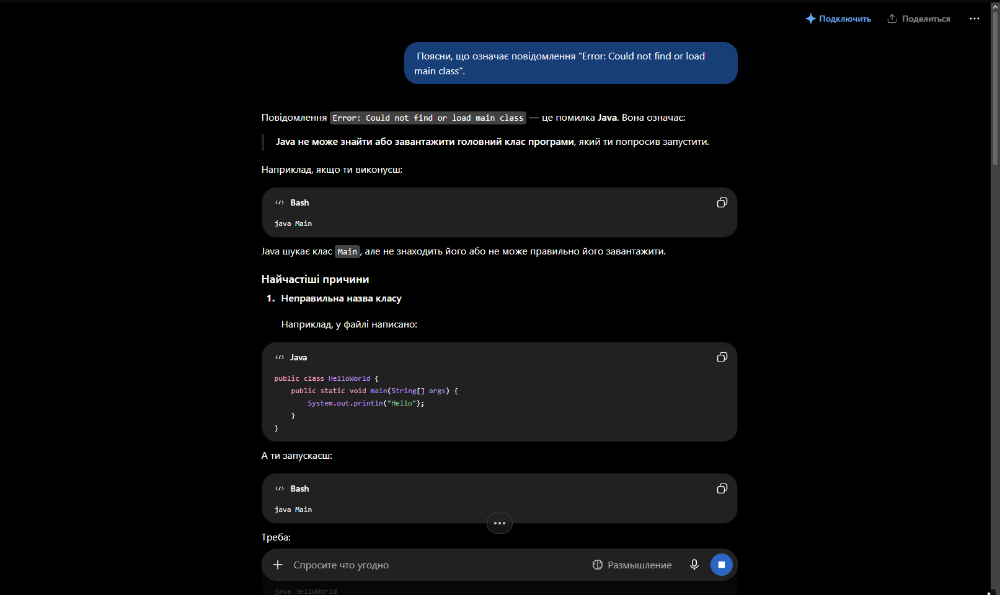

# Практичне заняття №0. Підготовка робочого середовища розробника

* Студент: Коровченко-Топузов Деонисій
* Група: 213 група онлайн
* Дисципліна: Алгоритмізація та основи програмування

### Посилання на профілі:
* https://github.com/dekot0
* https://leetcode.com/u/dekot0/
* https://www.hackerrank.com/profile/dionisi787

### Знімки екрана (Звіт про виконання):

1. **Перевірка версій java, javac та git в терміналі + SSH github:**
   

2. **Запуск першої програми Hello, World! в IntelliJ IDEA:**
   

3. **Розв'язана задача Welcome to Java! на HackerRank:**
   

4. **Тестовий запит до ChatGPT:**
   

*  Я не оформив платну підписку КЛауд, тому я буду використовувати Клауд веб версію.

